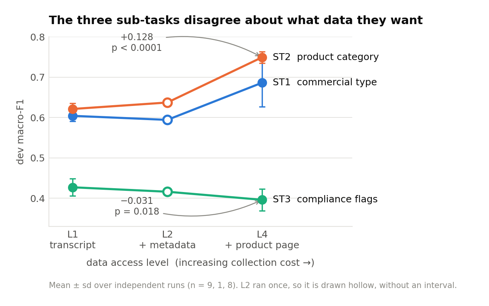
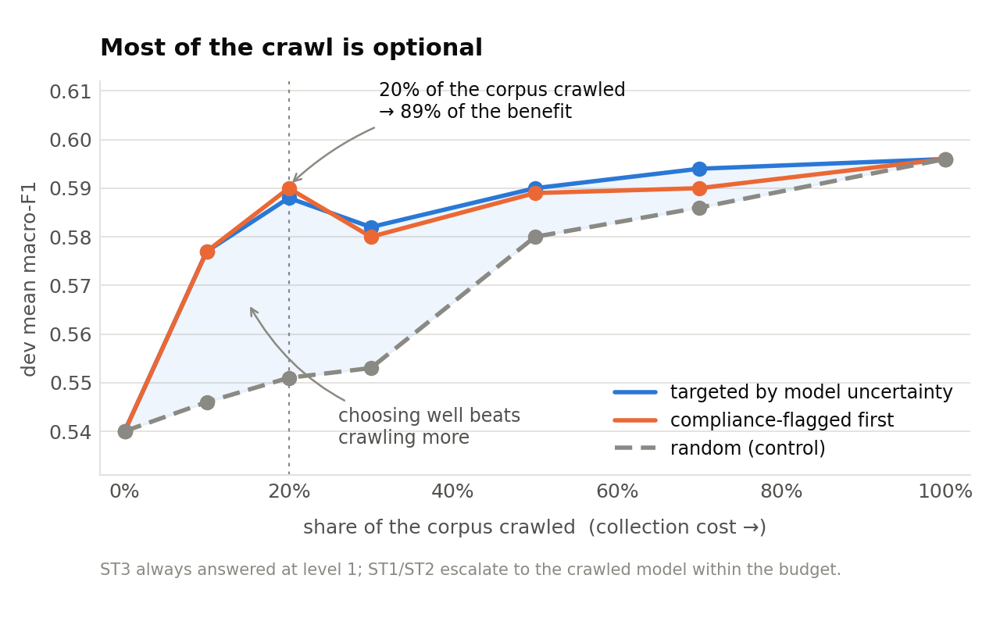
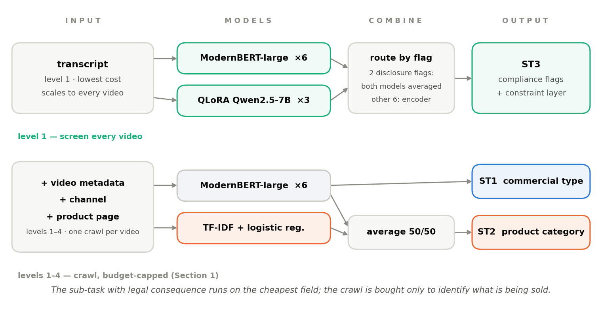
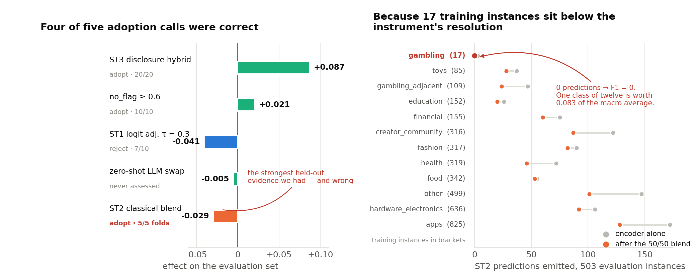

# ChildSafeAds — System Design Report

**Team pragyananda** · NLLP @ EMNLP 2026 · one 16 GB GPU · 22 GPU-hours · no paid API · no instance leaves the machine

**`mean_macro_f1` 0.6223** — ST1 0.5906 · ST2 0.6979 · ST3 0.5784 · ST3-family 0.6501 · coverage 1.0

Code, figures and full ablations: **https://github.com/pragyananda/childsafeads-nllp2026**

Full ablations: [`system_design_report_FULL.md`](system_design_report_FULL.md).

The task asks what a regulator could achieve at each level of data access. We treated that as
the question and accuracy as the instrument. The answer is that **the three sub-tasks
disagree** — about which data they want *and* which model family they want — so the system
routes rather than unifies.

### What this report contributes

1. **Access levels are worth different amounts per sub-task, and one is worth less than nothing.** Across 21 runs the crawl buys ST2 +0.128 and *costs* ST3 0.031. The sub-task with actual legal consequence is best served by the cheapest field. (Section 1)
2. **A cascade that prices this.** Crawling 20 % of the corpus retains 89 % of what crawling all of it buys, and choosing *which* 20 % matters more than crawling more. (Section 1)
3. **Routing beats ensembling when the mechanism is stateable.** A QLoRA LLM that is worse on six flags of eight, and 0.051 worse on the ST3 macro, is still the best model we have on the flag carrying a *per se* prohibition. Averaged into all eight flags it wins 10/20 splits; restricted to the two flags where we can say why, 20/20. (Section 5)
4. **Legal grounding decomposed.** The taxonomy's plain-language definitions are worth +0.038; the statutory citations on top are worth −0.002 — except on the one flag whose legal standard is genuinely contextual, where they produce our best score. (Section 6)
5. **A negative result about validation itself.** A component that won **5 folds of 5** on a 2,857-instance cross-validation lost 0.029 on the evaluation set, because under macro-F1 the effective sample size is set by the rarest class, not the corpus. We report the mechanism and the rule we would now apply. (Section 4)
6. **Deployment costed in review-queue units**, not F1: what a defensible recall target does to an analyst's workload. (Section 7)

**Where this places us.** 0.6223 against a top score of 0.7347 over 21 teams — mid-field, and
Section 9 says plainly where the gap is and what we now think it would have taken to close it.
Nothing in this report is a claim we did not measure.

## 1 · The crawl helps two sub-tasks and hurts the third

Same architecture, each access level, repeated across seeds. Dev macro-F1, mean ± sd; Welch's
t-test across runs.

| Levels | Runs | ST1 | ST2 | ST3 |
|---|---:|---|---|---|
| L1 — transcript | 9 | 0.604 ±.013 | 0.621 ±.014 | **0.427 ±.021** |
| L2 — + video metadata | 1 | 0.594 | 0.637 | 0.416 |
| L4 — + product page @2048 tok | 8 | **0.686 ±.059** | **0.749 ±.014** | 0.396 ±.027 |
| | | **+0.083** (p=.005) | **+0.128** (p<.0001) | **−0.031** (p=.018) |



The sub-task with actual legal consequence — *is this disclosed, does it exhort a child to
buy* — needs **nothing beyond the transcript**. Page boilerplate is a distractor competing for
the same context window; widening it from 1024 to 2048 tokens moved ST2 up and ST3 down in the
same runs.

**The cascade this implies.** Screen everything at level 1, crawl only where crawling changes
an answer. Simulated: 0 % budget → 0.540, 20 % → 0.590, 100 % → 0.596. **20 % of the corpus
retains 89 % of the crawl's value**, and at a 10 % budget targeted escalation scores 0.577
against random's 0.546 — most of the gain is in choosing well, not crawling more.
`src/analysis/monitor.py` implements this and reports cost in crawls issued and analyst segments queued.



## 2 · The system

Routed twice. Each routing is the output of a measurement, not a preference.

| | model | levels | selected on |
|---|---|---|---|
| **ST1** | ModernBERT-large, 6 seeds averaged | 1–4 | crawl +0.083; classical arm *loses* 0.019 here |
| **ST2** | that encoder + a classical TF-IDF arm, 50/50 | 1–4 | +0.070, 5/5 CV folds — **this call was wrong, Section 4** |
| **ST3** | ModernBERT-large @ L1, 6 seeds; disclosure flags averaged with a QLoRA Qwen2.5-7B | 1 (LLM: 2) | crawl −0.031; +0.029, 20/20 splits |



One backbone, three heads, pos-weighted BCE so flags with 40 training instances are not
drowned by ones with 1,277. The classical arm's decisive feature is **character n-grams (3–5)
over the outbound URL** — brand identity is a substring, and 65 % of test instances promote a
domain seen in training. The LLM is fine-tuned as an eight-way **sequence classifier, not a
generator**, so it emits probabilities that average with the encoder's.

**Constraint layer** on ST3, in order — thresholds 0.5 except `inadequate_disclosure` at 0.40:
the paid-promotion label rules out `undisclosed_advertising` (holds in **0 of 1,281** training
instances); the two disclosure flags are exclusive, `undisclosed_advertising` surviving; a
near-empty transcript (median 2 words vs a corpus median of 222) forces `insufficient_context`;
otherwise `no_flag` above 0.6 stands alone. Worth **+0.057 on 19/20 held-out halves** — not
decoration. Every constant was fixed by the Section 4 criterion, none by gradient on dev.

## 3 · Result

Five submissions. The first four measured components one at a time, so effects decompose exactly.

| | Sub. 4 | **Final** | Held-out prediction | Delivered |
|---|---|---|---|---|
| **mean** | 0.6030 | **0.6223** | — | **+0.0193** |
| ST1 | 0.5906 | 0.5906 | unchanged by construction | exact |
| ST2 | **0.7272** | 0.6979 | +0.070, 5/5 folds | **−0.0293 — reversed** |
| ST3 | 0.4913 | **0.5784** | +0.072, 20/20 splits | **+0.0871 — 121 %** |

ST1 predictions are byte-identical to the scored run, so (−0.0293 + 0.0871)/3 = +0.0193
against +0.0193 reported — no residual. **ST3 went from weakest in the field to mid-field and
carried the entire gain.** The ST2 change cost 0.0098; the same system without it scores **0.6321**.

## 4 · What a validation instrument cannot see

Identical configurations — same code, same seed — scored 0.618 and 0.575. Run-to-run spread
(ST1 0.089, ST3 0.056) exceeds most effects we wanted to measure, so nothing was adopted on
effect size. The rule was **consistency across resampled channel-grouped splits**: ≥ 18/20
halves of dev, or ≥ 4/5 folds of a 5-fold CV over train+dev (2,857 out-of-fold instances).
Five components were both assessed and measured on the evaluation set:

| Component | Criterion's call | Test effect | |
|---|---|---|---|
| `no_flag` ≥ 0.6 | adopt (10/10) | **+0.0206** | ✅ |
| ST1 logit adjustment τ=0.3 | reject (7/10) | **−0.0405** | ✅ shipped against it |
| zero-shot LLM exhortation swap | never assessed | −0.005 | — |
| ST3 disclosure hybrid | adopt (20/20) | **+0.0871** | ✅ |
| **ST2 classical blend** | **adopt (5/5 folds)** | **−0.0293** | ❌ |



**Four of five correct — and the failure was on the larger instrument.** The blend moves ST2
from 1.89 labels per instance to 1.43, toward the training prior of 1.32 — and it cuts every
class, the rare ones hardest. `gambling` is predicted **zero times**, fixing its F1 at 0. ST2 macro-averages over twelve
classes, so one class dropping out costs up to **1/12 = 0.083**; the observed loss is 0.029.
A single rare class, extinguished by an operating-point shift, accounts for the whole regression.

**Why 2,857 instances could not see it.** Under macro-F1 the **effective sample size is set by
the rarest class, not the corpus**. `gambling` has 17 instances — three per fold. Enough to
fire occasionally, never enough for five folds to agree. The 5/5 came from eleven
well-populated classes moving together; the twelfth, carrying 8.3 % of the metric, sat below
the instrument's resolution.

We had earlier argued that the encoder's over-prediction relative to the training prior was
correct behaviour under macro-F1, then withdrew it when fold-honest thresholds recovered
+0.035 of the blend's +0.070. **The original claim was right** — over-prediction is what keeps
a 17-instance class alive. The blend's two halves had opposite signs on test, and averaging
delivers both inseparably, so the component could not be salvaged by switching one off.

**The rule we would now apply.** Consistency across resampled splits remains the right signal —
it was right four times in five, including on the two largest dev gains in the project, both of
which reversed. What must be added is that *it is only informative about the classes the
resamples contain.* Before adopting any multi-label change: no class may lose more than half
its predictions, and none may go to zero. More generally, **an instrument can be enlarged,
resampled and cross-checked and still be systematically blind, if the quantity that decides the
outcome is thinner than its resolution.** Ours was built to defeat run-to-run noise, which it
did. It was never built to measure a class with 17 examples, and nothing in its 5/5 fold record
announced that limitation.

## 5 · Routing beats ensembling when you can name the mechanism

The QLoRA model against the encoder it improves — dev, flat 0.5, no constraint layer:

| Flag | gold n | encoder | **QLoRA** |
|---|---:|---:|---:|
| undisclosed_advertising | 74 | 0.610 | **0.850** |
| inadequate_disclosure | 118 | 0.369 | **0.482** |
| age_restricted_or_prohibited | 16 | **0.600** | 0.160 |
| **ST3 macro** | | **0.503** | 0.452 |

**Worse on six flags of eight — and it holds the best score in the project on a flag carrying
a *per se* prohibition under UCPD Annex I.** The mechanism is stateable: both disclosure flags
are **written tests over the presence and placement of a string**, decidable by a model that
can read the test; the encoder can only infer the rule from 2,353 examples of its application.
`age_restricted` is a category to be recognised, not a test to be applied, and there the LLM
has seen far too few.

That decides how they combine. Averaging the LLM into **all eight** flags gives the larger dev
mean (0.541 vs 0.530) and wins **10/20** splits at sd 0.040; into **the disclosure family
only**, +0.029 at sd 0.009 and **20/20**. We shipped the smaller, consistent gain. Restricting
an ensemble to where you can say *why* it should help is the difference between 20/20 and a
coin flip — and a component worse everywhere on average can still be the best one available
somewhere specific, which the summary metric actively hides.

## 6 · Legal grounding, measured

A local Qwen2.5-7B on ST3 zero-shot in three conditions differing **only** in legal grounding;
model, decoding, instances and parsing identical.

| Condition | ST3 macro | direct_exhortation |
|---|---:|---:|
| bare flag names | 0.254 | 0.41 |
| + taxonomy definitions | 0.292 (**+0.038**) | 0.41 |
| + provisions from `legal_provisions.json` | 0.290 (**−0.002**) | **0.45** |

**Definitions help; citations do not** — except on `direct_exhortation`, the one flag whose
taxonomy entry is an explicit three-part contextual test, where the provisions condition beats
every system in this project. Statutory grounding earns its tokens exactly where the legal
standard is contextual.

**A caution about every score here, ours included.** The encoder scores 0.76 on
`misleading_claim` where a zero-shot model scores 0.02, and eight demonstrations move it from
0.09 to 0.70. It has learned that the annotation pipeline applies that flag to 54 % of
instances; no reading of UCPD Arts. 6–7 predicts that rate. **These scores measure agreement
with an annotation policy, not with law.**

## 7 · What the output costs an authority

Level-1 model, the two practices prohibited outright under UCPD Annex I:

| Flag | Prevalence | Recall | Precision | Reviewed / 1,000 |
|---|---:|---:|---:|---:|
| undisclosed_advertising | 14.7 % | 80 % | 0.39 | 301 |
| direct_exhortation | 15.3 % | 80 % | 0.22 | 567 |

Undisclosed advertising is tractable. **Direct exhortation is not deployable at any operating
point we measured** — at 80 % recall three quarters of the queue is noise, consistent with its
definition being a contextual test.

Two things an unweighted metric hides. **Severity-weighting** (per se 3, conditional 2, soft
law 1) *widens* the level-1 advantage from +0.030 to +0.040: the cheap tier is better precisely
where the law is strictest. And **ranking, not flagging, is what an analyst experiences** —
the top 10 % of a severity-ranked queue surfaces 28 % of all *per se* violations at 76 %
precision against a 26.8 % base rate. Flagging alone reproduces a firehose, since the reference
itself marks `misleading_claim` on 54 % of instances.

## 8 · Measured and discarded

| | Result |
|---|---|
| Outbound-domain gazetteer | +0.13 over TF-IDF, **+0.001** over the encoder, which memorises the same brands unaided |
| Keyword lexicon from the taxonomy | F1 0.12; *worse* at level 4 — pages mention alcohol incidentally |
| Per-label ST3 thresholds | dev +0.05; honest transfer −0.034, **3/30 splits** |
| Joint thresholds, coordinate ascent | dev **0.545**, the largest apparent gain in the project — 8 parameters fitted to 504 instances. Not submitted |
| Retrieved few-shot (8 demos) | 0.368 vs the encoder's 0.427 |
| Classical ML for ST1 | −0.019, 2/5 folds |
| ST1 class-weighted majority vote | dev +0.046; held out −0.005 ± 0.088, 6/10 |
| DeBERTa-v3 second architecture | diverged; abandoned |

The joint-threshold result is the instructive one: **the more faithfully a tuning procedure
models the metric's structure, the more effectively it fits the sample it is tuned on.**

**Three release notes.** `dev.jsonl` **is not valid JSONL** — six of 504 records span multiple
lines, so the shipped `load_data.py` raises on instance 0 and naive line-parsing silently
yields 503 of 504. Splits are channel-disjoint but **not brand-disjoint** — two thirds of dev
and test promote a domain seen in training. ST1 is macro-averaged over **reference-present
labels only**; averaging over all five moves identical predictions by ~0.13. We confirmed the
implementation by matching a submission scored 0.6185 to a local 0.6183.

## 9 · Compute, reproduction, limits

**22 GPU-hours on one 16 GB card**, all one-off training: 6 × ModernBERT-large L4@2048 (5.2 h),
6 × L1@1024 at 6 epochs (7.8 h), 3 × QLoRA on Qwen2.5-7B (9.0 h), TF-IDF ~10 min on CPU.
Inference over all 3,360 instances **~2 GPU-h**, nine tenths of it the 7B. The whole study,
including Section 8, ~45 GPU-h across 58 fine-tuning runs. Nothing left the machine — a compliance
property under the corpus's research-use terms, not only a cost choice.

The 7B is 82 % of training cost for two flags of eight. It is the first thing to drop under a
compute constraint: the encoder-only ST3 arm retains 0.502 of the blend's 0.530.

```bash
for s in 0 1 2 3 4 5; do
  python src/models/encoder.py --level 4 --maxlen 2048 --seed $s                       # ST1, ST2
  python src/models/encoder.py --level 1 --maxlen 1024 --epochs 6 --seed $s --tag _ep6 # ST3
done
for s in 0 1 2; do python src/models/llm_finetune.py --seed $s; done                   # specialist
python src/models/classical.py --task st2 --save
python src/build/build_st3_hybrid.py --split test \
  --out work/probs_test_L1_ModernBERT-large_len1024_seed0_hyb3.npz
python src/build/make_test_submission.py --tag "" --seeds 0 1 2 3 4 5 --st3-tag _hyb3 \
  --classical-st2 work/classical_test_st2.npz --no-flag-t 0.6 \
  --disclosure-tiebreak keep_undisc --inadequate-t 0.40 --out SUBMIT_BEST.jsonl
```

| directory | what is in it |
|---|---|
| `src/core/` | data loading (including the `dev.jsonl` fix), the metric replica, the taxonomy constraint rules, submission writing |
| `src/models/` | the three arms — encoder, QLoRA specialist, classical TF-IDF |
| `src/build/` | routing and assembly of a submission file |
| `src/analysis/` | the cascade monitor, the regulator costing, the figures in this report |
| `src/explored/` | everything in Section 8 that we measured and did not ship, kept so the negative results are checkable |

We rebuilt the submitted file from these commands and diffed all 503 predictions: **zero
differ.** `src/core/metrics.py` is the local metric replica, validated to 0.0002 against a scored
submission. The long-form version of this report, with every ablation table behind the numbers
quoted here, is [`REPORT_FULL.md`](REPORT_FULL.md) in the same
repository.

**Where the gap to the top of the leaderboard is.** Our 0.6223 sits against a top score of
0.7347. Roughly half the distance to the strongest systems is ST2: entries using open-weights
LLMs at levels 1–4 report ST2 around 0.82, against our best-ever 0.7272 — a margin larger than
everything we gained all task. That is worth stating precisely, because it indicts a conclusion
we drew ourselves. We concluded ST2 was a *lexical* problem — brand identity recoverable from
character n-grams over the URL — and built for that. But the two families we compared were an
encoder truncating page text at 2,048 tokens and TF-IDF, which *can only* match lexically.
Neither was capable of detecting comprehension-based headroom on the product page. We had a
fine-tuned 7B in the system and never pointed it at ST2, because the crawl ablation had already
routed our attention to ST3. **This is the same failure as Section 4 at a larger scale**: a
comparison that was fair, repeated and honest, and structurally unable to see the alternative
that mattered. Given the run again, the first experiment would be a generative LLM on ST2 with
the page in context.

**Limits.** The ST2 blend was a mistake and we shipped it (Section 4); submissions were exhausted, so
the corrected system at **0.6321** is reported but not leaderboard-verified. L2 was run once
and we claim nothing about its position. ST3's level-1 advantage is significant (p = 0.018)
but modest (0.031), supporting *the crawl does not help ST3* more than any ordering among the
cheap levels. The LLM comparisons use one 7B at 4-bit. Labels are automatically annotated with
human validation, so every score measures agreement with that pipeline. ST1 was frozen after
submission 1: the evaluation set is 0.108 harder than dev on ST1, so no instrument we had
could validate an ST1 change — and the one time we shipped one on a dev-only signal, it cost
0.041.

*All figures dev macro-F1 under the leaderboard metric unless stated.*
